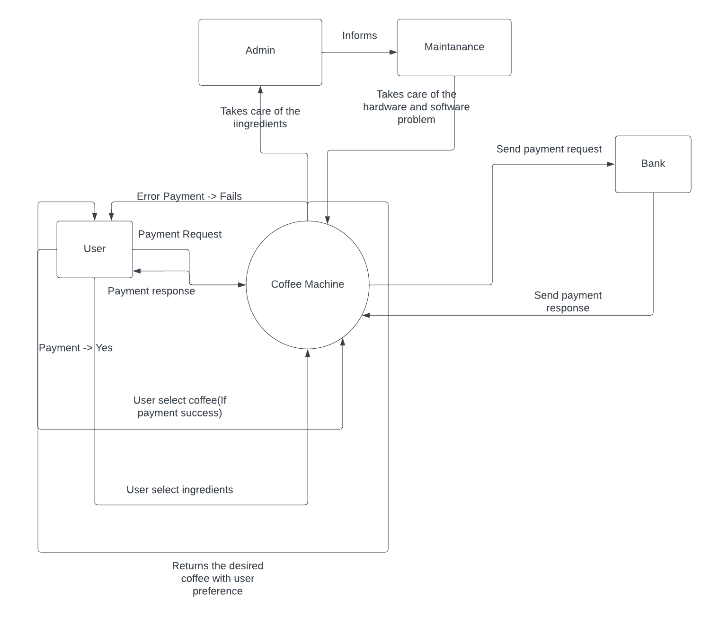
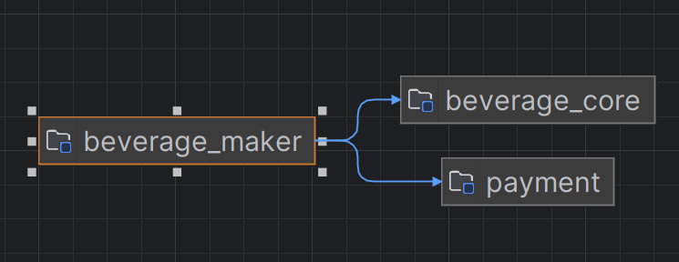
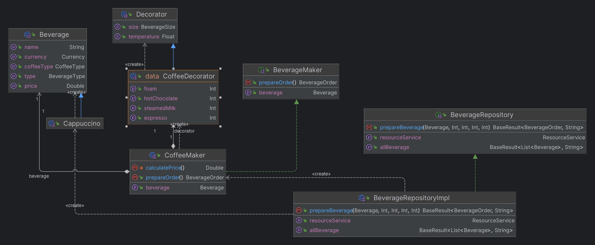

# Architecture Decision Record (ADR)
### Submitters

KH Rafiquel Islam (Alik)  
EngD trainee at Software Technology, 2023  
Eindhoven University of Technology

## Change Log

State is one of: Pending, Approved, Amended, Deprecated.

Date is an ISO 8601 (YYYY-MM-DD) string.

Status: **Pending**  
Last Updated: 2023-12-04

## Referenced Use Case(s)

- [An requirement e-mail from professor Dr. Yanja Dajsuren.](https://www.google.com)
- [UML diagram of the initial architecture.](assets/context_diagram.png)

Initially we were asked to implement a software for the coffee machine. 

## Context

At first the machine will display the list of Beverage in the console. 
Then user will select his/her beverage and based on the beverage type it will call the appropriate factory method. 
The ~~Factory~~ Repository is responsible for creating the appropriate [BeverageMaker](beverage_core/src/common/BeverageMaker.kt). 
Before creating the appropriate [BeverageMaker](beverage_core/src/common/BeverageMaker.kt) it'll check if the resources are available or not using a service. 
After selecting all the ingredients then user will have to pay using their payment pin. There will be a dedicated service for payment.
If the payment is successful, the Beverage Maker will create the final order based on selected beverage and ingredients and will pass that to factory. 
The factory will pass that to the machine wrapped inside a [BaseResult](beverage_common/src/BaseResult.kt). Below is the context diagram of the basic structure.

- The Application will be a moduler application. We'll follow the clean architecture pattern for this.
- The change in one module should not affect all module across the project.
- Used MVVM pattern for the development. It is a lot easier to decouple it when we needed.
- Initially I thought to use the [Builder Pattern](https://refactoring.guru/design-patterns/builder) to create the BeverageOrder. Later I discarded the idea because in Kotlin it doesn't come with a lot of benefits and sometimes creates bottlenecks.
- Used Factory pattern to create the BeverageOrder wrapped inside [BaseResult](beverage_common/src/BaseResult.kt).

## Proposed Design

- The Product will directly use 2 modules. 
- A module named **beverage_core** for getting and producing beverage based on user selection.
- A module named **payment** for payment.
- The application module will use the **beverage_core** and **payment** module.

**These Modules should be independent and should not depend on each other.**

Below is the diagram to show how the application will use these modules

There will be another internal module called beverage_common that will be shared across all the modules except the app module. This shared module will hold the code/functionality that will be shared across all the modules except the app module itself.

  ### App Module
- The application will use the MVVM design pattern. And it'll have an observer for the views to observe.
- We'll be making data driven UI. The business data will be exposed to the view as UiState. Based on UI state we'll create/update our views.

 ### Core Module
- Created Two Repository for Beverage functionality and Payment functionality. 
- Implemented the Strategy pattern for [BeverageMaker](beverage_core/src/common/BeverageMaker.kt) such as create the set of objects (e.g: [CoffeeMaker](beverage_core/src/coffee/CoffeeMaker.kt), [HotChocolateMaker](beverage_core/src/chocolate/HotChocolateMaker.kt)) of this and makes them interchangeable inside original context object.
- Implemented the Strategy pattern for [Decorator](beverage_core/src/common/data/Decorator.kt) such as create the set of objects (e.g: [CoffeeDecorator](beverage_core/src/coffee/CoffeeDecorator.kt)) of this and makes them interchangeable inside original context object.
- Implemented the Factory pattern to create appropriate [BeverageMaker](beverage_core/src/common/BeverageMaker.kt)

Below is the class diagram of beverage_module

  ### Payment Module
- Functionality of payment will be exposed by [PaymentRepository](payment/src/PaymentRepository.kt).

## Considerations

Didn't use any Architecture like MVC or MVP, instead we used MVVM design pattern for more testable code. 
We are using observers to observe the UI state. This will reduce our code and also increase the readability of our code. 
Also thinking about how to pass the user input to the Repository for different types of beverage. 
Might create some other function of name [prepareBeverage()](beverage_core/src/common/BeverageRepository.kt) with different parameter (Polymorphism).

## Decision

- We decided to develop no user interfaces for this particular project. This project is more focused on how to design a structure of a beverage machine.
- As per the design, The software is very open for any future requirements. 
- We also have the support to sell other _**types**_ of beverages such as Ice-cream and Beers. 

## References
- [Don't Use The Builder Pattern in Kotlin.](https://backendhance.com/en/blog/2021/dont-use-builder-in-kotlin/)

