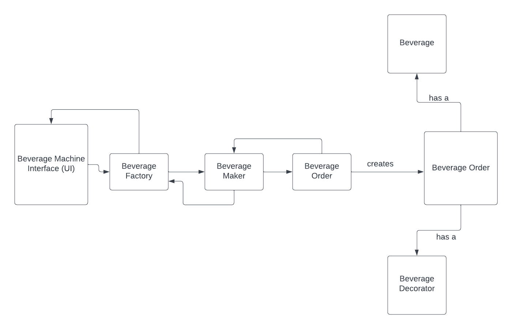
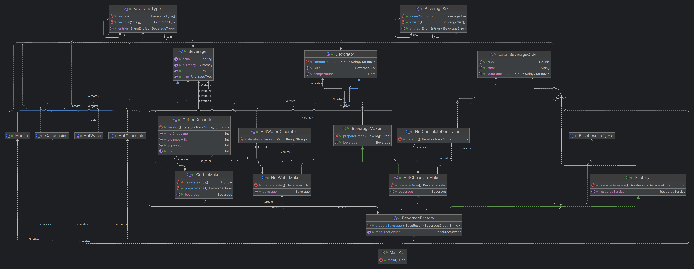

# Architecture Decision Record (ADR)
### Submitters

KH Rafiquel Islam (Alik)  
EngD trainee at Software Technology, 2023  
Eindhoven University of Technology

## Change Log

State is one of: Pending, Approved, Amended, Deprecated.

Date is an ISO 8601 (YYYY-MM-DD) string.

Status: **Pending**  
Last Updated: 2023-11-28

## Referenced Use Case(s)

- [An requirement e-mail from professor Dr. Yanja Dajsuren.](https://www.google.com)
- [UML diagram of the initial architecture.](assets/class_diagram.png)

Initially we were asked to implement a software for the coffee machine. 

## Context

At first the machine will display the list of Beverage in the console. Then user will select his/her beverage and based on the beverage type
it will call the appropriate factory method. The Factory is responsible for creating the appropriate beverage maker. Before creating the appropriate beverage maker it'll check if the resources are available or not using a service. The Beverage Maker will
create the final order based on selected beverage and ingredients and will pass that to factory. The factory will pass that to the machine 
wrapped inside a [BaseResult](src/main/kotlin/common/data/BaseResult.kt). Below is the flow diagram of the basic structure.

- Initially I thought to use the [Builder Pattern](https://refactoring.guru/design-patterns/builder) to create the BeverageOrder. Later I discarded the idea because in Kotlin it doesn't come with a lot of benefits and sometimes creates bottlenecks.
- Used Factory pattern to create the BeverageOrder wrapped inside [BaseResult](src/main/kotlin/common/data/BaseResult.kt).

## Proposed Design

- Implemented the Strategy pattern for [BeverageMaker](src/main/kotlin/common/maker/BeverageMaker.kt) such as create the set of objects (e.g: [CoffeeMaker](src/main/kotlin/coffee/CoffeeMaker.kt), [HotChocolateMaker](src/main/kotlin/chocolate/HotChocolateMaker.kt)) of this and makes them interchangeable inside original context object.
- Implemented the Strategy pattern for [Decorator](src/main/kotlin/common/decorator/Decorator.kt) such as create the set of objects (e.g: [CoffeeDecorator](src/main/kotlin/coffee/CoffeeDecorator.kt)) of this and makes them interchangeable inside original context object.
- Implemented the Factory pattern to create appropriate [BeverageMaker](src/main/kotlin/common/maker/BeverageMaker.kt)

Below is the class diagram of the beverage machine project.

## Considerations

Didn't use any Architecture like MVC or MVP. But might introduce one of these later period. Also thinking about how to pass the user input to the factory for different types of beverage.
Might create some other function of name [prepareBeverage()](src/main/kotlin/common/factory/Factory.kt) with different parameter (Polymorphism). Also thinking about restructuring the packages.

## Decision

- We decided to develop no user interfaces for this particular project. This project is more focused on how to design a structure of a beverage machine.
- As per the design, The software is very open for any future requirements. 
- We also have the support to sell other _**types**_ of beverages such as Ice-cream and Beers. 

## References
- [Don't Use The Builder Pattern in Kotlin.](https://backendhance.com/en/blog/2021/dont-use-builder-in-kotlin/)

